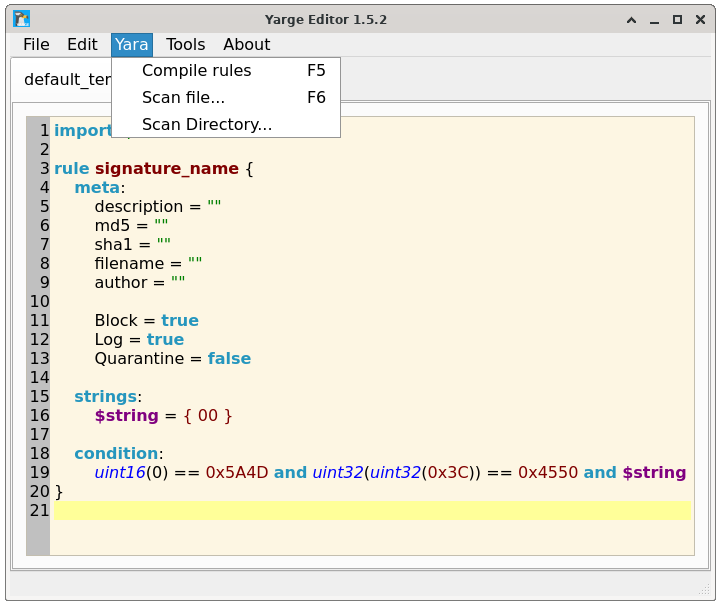

# Yarge Editor


Yarge Editor is a powerful, cross-platform, free, and open-source tool designed specifically for editing [YARA](https://github.com/VirusTotal/yara) rules.



# Building 
```bash
$ git clone https://github.com/jlamk/yarge.git
$ cd yarge
$ qmake
$ make
$ sudo make install
$ ./yarge
```

# Dependencies
[libyara](https://github.com/VirusTotal/yara)<br>
[libjansson](https://github.com/akheron/jansson)<br>
libssl<br>
qt<br>
qmake<br>
